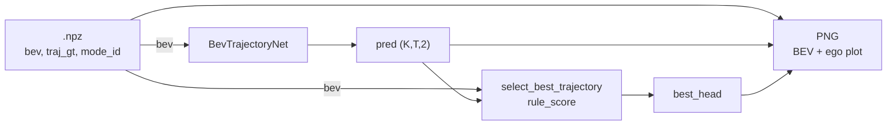
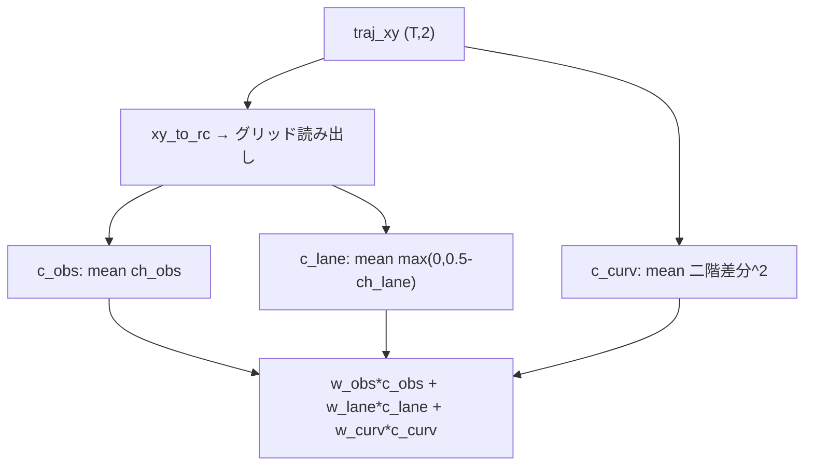

# Planner BEV: 推論ルールとモデル規模のスナップショット

本書は **精度を最優先**する前提で、現状の **ルールベース軌道選択（`lib/rule_score.py`）**、**`BevTrajectoryNet` の構成とパラメータ規模**、および **検証可視化までのデータフロー**を一枚に整理したメモです。実装の一次情報はコード（特に `aichallenge/ml_workspace/planner_bev/lib/rule_score.py` と `lib/model.py`）に従います。

---

## 1. 現状の rule（推論時ヘッド選択）

### 1.1 役割

学習済みモデルは **K 本の候補軌道** `(K, T, 2)`（ego 座標、前方 x・左方 y、T ステップ）を同時に出力する。**本番相当の既定**は、BEV と各候補だけを見て **スカラーコストが最小のヘッド index** を選ぶ（`select_best_trajectory` → `argmin`）。

参照: `viz_val_infer_bev.py` の `--selection rule`（デフォルト）で `select_best_trajectory(bev, pred)` を呼ぶ。

### 1.2 BEV グリッドと投影

`BEVGridSpec`（`lib/rule_score.py`）は `bev_scene_stack` と同じ慣習（ego `base_link`、x 前方・y 左方）で、メートル → ピクセル `(row, col)` を次式で決める。

- `row = int((x_max - x) / res)`、`col = int((y_max - y) / res)`
- 既定: `x ∈ [-12, 52]`、`y ∈ [-18, 18]`、`res = 0.25`、`h = 256`、`w = 144`

軌道の各点でグリッド内ならそのセルのチャネル値を読む；範囲外の点は **コストに寄与しない**（スキップ）。

### 1.3 スコア定義（低いほど良い）

`score_trajectory(bev, traj_xy, spec, w_obs=1.0, w_lane=0.3, w_curv=0.05)`:

| 項 | BEV チャネル | 意味（要約） |
|----|----------------|-------------|
| **障害コスト** `c_obs` | `bev[2]` obstacles | 軌道上の平均障害強度（大きいほどペナルティ） |
| **レーンコスト** `c_lane` | `bev[0]` lane | セル値が高いほど「レーン上」とみなし良い → `max(0, 0.5 - ch_lane)` で「レーンから外れる」ほどコスト |
| **曲率コスト** `c_curv` | — | 3 点以上あるとき、二階差分 `d2 = x[t+2] + x[t] - 2*x[t+1]` の二乗平均（急変にペナルティ） |

合成:

\[
\text{score} = w_{\text{obs}}\, c_{\text{obs}} + w_{\text{lane}}\, c_{\text{lane}} + w_{\text{curv}}\, c_{\text{curv}}
\]

- `c_obs`, `c_lane` は **有効セル数で正規化された平均**（時間ステップ T で割る）。
- **重みは関数引数だが、呼び出し側は既定値のまま**（`select_best_trajectory(..., **kwargs)` に渡さない限り `1.0 / 0.3 / 0.05`）。CLI や YAML からはまだ出ていない。

### 1.4 BEV チャネル索引（`lib/schema.py`）

`CHANNEL_NAMES = ("lane", "trajectory", "obstacles", "ego")` → インデックス 0〜3。rule は主に **0 と 2** を使用。

### 1.5 限界（精度観点で押さえるべき点）

- **モデル出力の「妥当さ」は直接見ない**（幾何・BEV のチャネル統計のみ）。別ヘッドが GT に近くても、障害が平坦・レーン信号が弱いと **誤ヘッドが勝つ**余地がある。
- **逐次インテグレーションや車両制約なし**（単発の polyline コスト）。
- **グリッド中心 1 セルサンプル**（サブピクセルや線分全体の積分ではない）。
- データによっては **障害チャネルが常にゼロに近い**など、`w_obs` が事実上効かず **`w_lane` と曲率項のバランスだけ**で順位が決まる局面がありうる。

---

## 2. 現状のモデル（規模と構造）

### 2.1 アーキテクチャ概要（`BevTrajectoryNet`）

- **入力**: BEV `(B, 4, 256, 144)`、任意で `aux` `(B, aux_dim)`（`train.yaml` 既定は `aux_dim: 0`）。
- **エンコーダ**: `Conv2d 3×3, stride=2, padding=1` のステージを `stem_channels` 通り重ねる。既定は **`(32, 64, 128, 256)` の 4 段**（空間解像度は各段で約 1/2）。
- **プーリング**: `AdaptiveAvgPool2d(1)` で **空間を 1 ベクトルに潰す（GAP）**。
- **融合**: `Linear(encoder_out_ch + aux_dim → embed_dim)` + ReLU + Dropout。既定 `embed_dim = 256`。
- **ヘッド**: `K` 個の `Linear(embed_dim → horizon*2)`。既定 `K=4`、`horizon=40` → 各ヘッドは **80 次元のベクトルを reshape して軌道**。

### 2.2 パラメータ数（既定 `config/train.yaml` と一致するコンストラクタ）

同一設定で PyTorch に数えた概算（2026 時点の実装）:

| ブロック | パラメータ数 |
|----------|----------------|
| encoder（Conv+BN 等） | 389,184 |
| fuse（Linear+Dropout はパラメータ主に Linear） | 65,792 |
| heads（K=4 の Linear） | 82,240 |
| **合計** | **537,216（約 0.54M）** |

### 2.3 「小さい」と感じる理由（精度志向でのコメント）

- **全体で約 54 万パラメータ**は、セマンティック BEV やマルチモーダル計画を扱う一般的なビジョンモデルと比べると **かなりコンパクト**。
- **GAP のため、エンコーダが保持する空間情報は最終段のチャネル統計に圧縮される**。細かいレーン形状や局所障害の配置は、浅いステム＋単一ベクトル表現に **詰め込む負荷が大きい**。
- 軌道は **グローバル埋め込みからの線形射影**（各ヘッド 1 本の Linear）なので、**長い地平・複雑な曲率**を表現するには **容量と帰納バイアスの両面でタイト**になりやすい。

精度を上げる方向としては、例えば **空間解像度を保ったデコーダ**、**Transformer / 畳み込みデコーダ**、**より深い stem または embed**、**補助タスク** などが候補になるが、本書では現状の「小ささ」の事実のみを明示する。

---

## 3. 図: 現状のデータフローと rule の位置

### 3.1 検証 PNG 生成まで（`viz_val_infer_bev.py`）

- **teacher モード**（`--selection teacher`）では `R` を使わず `mode_id` を `best_head` に固定（デバッグ／教師上界の確認用）。

### 3.2 `score_trajectory` の内部（概念）

### 3.3 学習側との関係（参照のみ）

学習損失・教師ラベル・`aux_all_heads_lambda` の詳細は別紙 `planner_training_inputs_and_losses.md` を参照。推論 rule は **損失に出てこない独立モジュール**である点が、検証で「モデルは当たりヘッドを出せるのに rule が外す」現象を生みやすい。

---

## 4. 関連ファイル

| 内容 | パス |
|------|------|
| rule 実装 | `aichallenge/ml_workspace/planner_bev/lib/rule_score.py` |
| モデル | `aichallenge/ml_workspace/planner_bev/lib/model.py` |
| 既定ハイパラ | `aichallenge/ml_workspace/planner_bev/config/train.yaml` |
| val 可視化・選択切替 | `aichallenge/ml_workspace/planner_bev/viz_val_infer_bev.py` |
| チャネル名・形状定数 | `aichallenge/ml_workspace/planner_bev/lib/schema.py` |

---

## 5. 変更履歴メモ

- 本ドキュメントはリポジトリ現状のコードに基づくスナップショット。rule の重みを YAML/CLI 化する場合は §1.3 と実装を同期して更新すること。
