<!-- _class: title -->
<!-- _header: "" -->

# 技術解説会
## 2026 大会の変更点概要 & 新コマンド解説

**自動運転AIチャレンジ 2026**

2026.03.02

---

<!-- _class: title -->
<!-- _header: "" -->

## 👋 セッション構成

### **Part 1** 🔧 できるようになったこと（田中）
### **Part 2** 📝 新コマンド解説（岩成さん）
### **Part 3** 🚗 複数台AWSIMアーキテクチャ（久保田さん）
### **Part 4** 🤖 End-to-End AI の入門（田中(新)さん）

---

# AWSIM シミュレータの走行画面

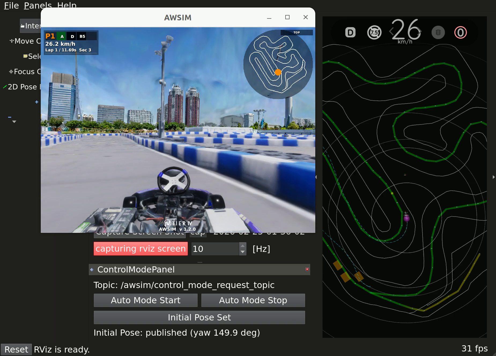

**AWSIM** + **RViz2** による統合ビュー — 左：3D シミュレータ環境 / 右：地図と軌道の可視化

---

<!-- _class: title -->
<!-- _header: "" -->

# ========== Part 1 開始 ==========
## 変更点概要 & できるようになったこと

---

# 🎉 2026 でできるようになったこと

### CPU 環境でも快適に開発可能
- 2025: GPU 必須（NVIDIA ドライバセットアップが大変）
- **2026**: `.env` の1行で CPU/GPU 切り替え → CPU 環境でも AWSIM が動作

### セットアップが超シンプル
- 2025: 複数ステップを手動で実行 → 環境差異でハマる人多発
- **2026**: `curl ... | bash` 1行で完結 → 初心者も迷わない

### 複数台同時走行・評価が実現
- 2025: 単台のみ / 複数チームの比較は順番に実行
- **2026**: 最大4台を同時走行 → 公平・高速な評価が可能

### 操作インターフェースが統一・シンプル化
- 2025: `./docker_run.bash dev` でシェルスクリプト実行
- **2026**: `make dev` で Makefile 経由（入口が統一されて分かりやすい）

### AWSIM シナリオ機能が大幅拡張
- **シナリオ作成機能**: GUI で Race Setup パネルからシナリオを設計・保存
- **起動オプション**: `--vehicles`, `--laps`, `--timeout` など詳細制御が可能
- **オンライン対戦**: 複数チームがリアルタイムで同一フィールドで競走可能

---

<!-- _header: "Part 1: 変更点概要" -->

# アーキテクチャ全体像

```
make dev / run_evaluation.bash
    ↓
docker compose up
    ↓
┌────────────────────────────────────┐
│  AWSIM (D0)  ←→  Autoware (D1-4)   │
│ Simulator    domain_bridge Control │
└────────────────────────────────────┘
    ↓
output/<run_id>/d1/, d2/, ...
  (Logs & Results Auto-Separated)
```

### 各コンポーネント

- **AWSIM**: 3D レーシングカートシミュレータ（Domain 0）
- **domain_bridge**: ROS 2 トピック中継（D0 ↔ D1-4）
- **Autoware**: 自動運転制御（Domain 1-4、最大4台並列）

---

# Domain ID で通信空間を分離

```
AWSIM ROS_DOMAIN_ID=0
  ↓
domain_bridge (話題を中継)
  ↓
Autoware D1  D2  D3  D4  (各台が独立)
```

- 最大4台を同一マシンで並列走行可能
- 各台が独立した通信空間 → 干渉なし
- 結果は Domain ID で自動分離
- **評価時間が 1/4 に短縮可能**

---

<div class="two-col">

<div class="two-col-left">

## 複数台走行 — Race Setup

**GUI パネルで簡単設定：**

- **Vehicles**: 1～4台
- **LiDAR**: ON/OFF
- **Camera**: ON/OFF
- **Boosters**: 加速ブースター
- **Collisions**: 衝突判定

</div>

<div class="two-col-right">

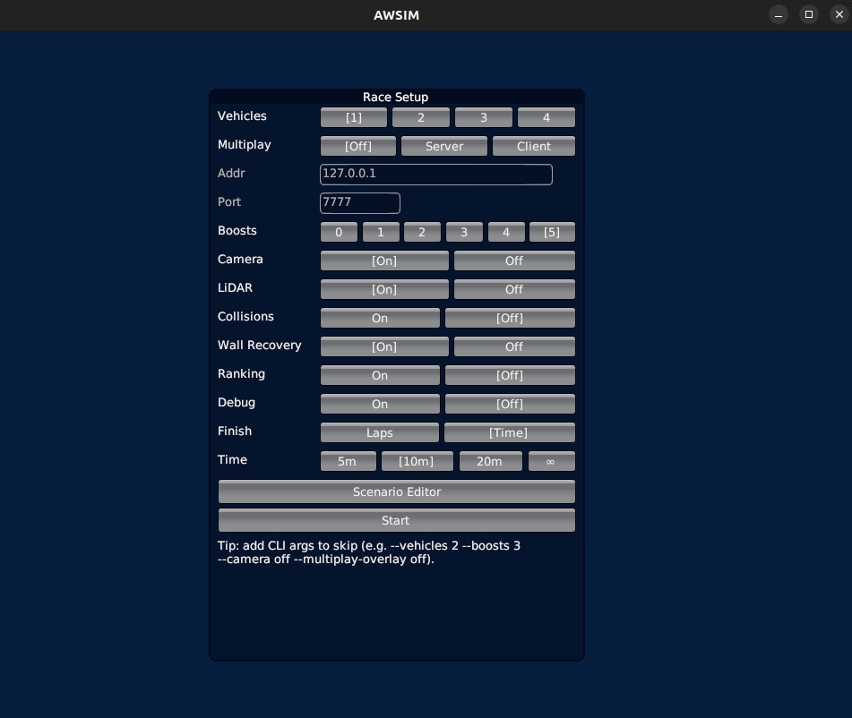

**Race Setup パネル**

</div>

</div>

---

# GPU / CPU 切り替え

`.env` ファイルの **1行だけ** で制御:

```bash
# GPU モード（デフォルト）
COMPOSE_FILE=docker-compose.yml:docker-compose.gpu.yml

# CPU モード: 上の行を削除 or コメントアウト
# COMPOSE_FILE=docker-compose.yml:docker-compose.gpu.yml
```

### 仕組み
- `docker-compose.yml` — CPU ベースの定義
- `docker-compose.gpu.yml` — GPU overlay（NVIDIA デバイス予約を追加）
- Docker Compose の **複数ファイルマージ** 機能を利用

### いつ CPU を使う？
GPU なし環境での動作確認 / CI・テスト環境 / 「まず動くか」の確認

---

# ディレクトリ構成 — 統一ログ出力

```
output/
├── 20260225-234959/         ← run_id（タイムスタンプ）
│   ├── d1/                  ← Domain ID 1
│   │   ├── autoware.log
│   │   ├── awsim.log
│   │   ├── result-details.json
│   │   ├── capture/         ← スクリーンキャプチャ
│   │   └── rosbag2_autoware.mcap
│   ├── d2/                  ← Domain ID 2（並列時）
│   └── d3/
├── latest/                  ← 最新 run へのシンボリックリンク
│   └── d1 → ../20260225-.../d1
└── docker/                  ← Docker ビルドログ
```

- **タイムスタンプ + Domain ID** で一意に識別
- `output/latest/` で「最新の結果」にすぐアクセス

---

# 評価フロー

### 単体評価（1台）
```bash
make eval        # 起動→待機→走行→結果収集→停止
```

### 並列評価（複数提出物を同時走行）
```bash
./run_parallel_submissions.bash \
  --submit submit/team_a.tar.gz submit/team_b.tar.gz
```

### 評価オーケストレータがやること
1. AWSIM 起動 & 準備完了を待機
2. Autoware 起動 & 初期位置設定
3. 走行開始 → 終了判定を監視
4. ログ・rosbag・キャプチャを収集
5. コンテナ停止 & クリーンアップ

---

# 走行開始直後（10秒時点）

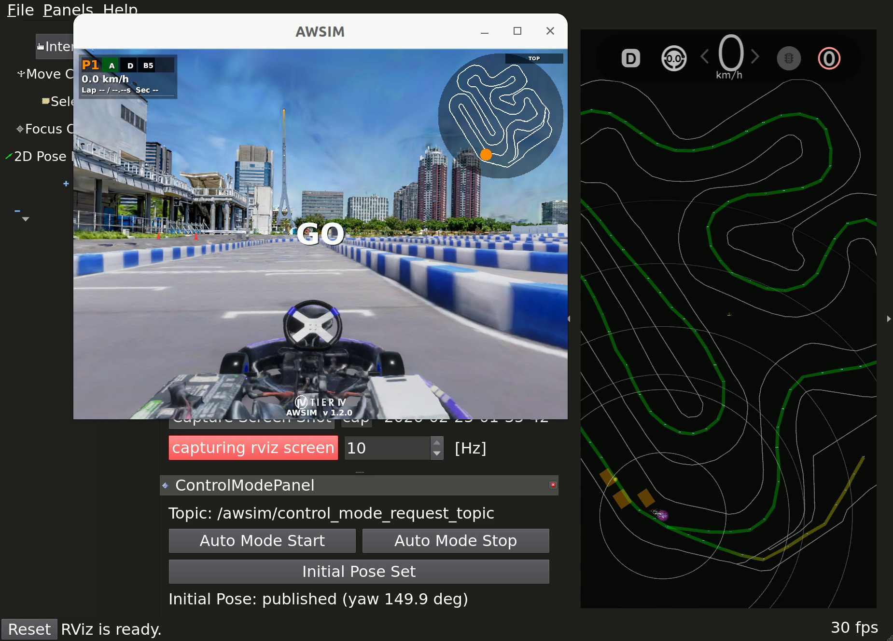

**AWSIM シミュレーション開始** — 両カートが加速・軌道追従を開始、LiDAR が周囲環境を認識

---

# 並列評価 — 複数台が同時に走る

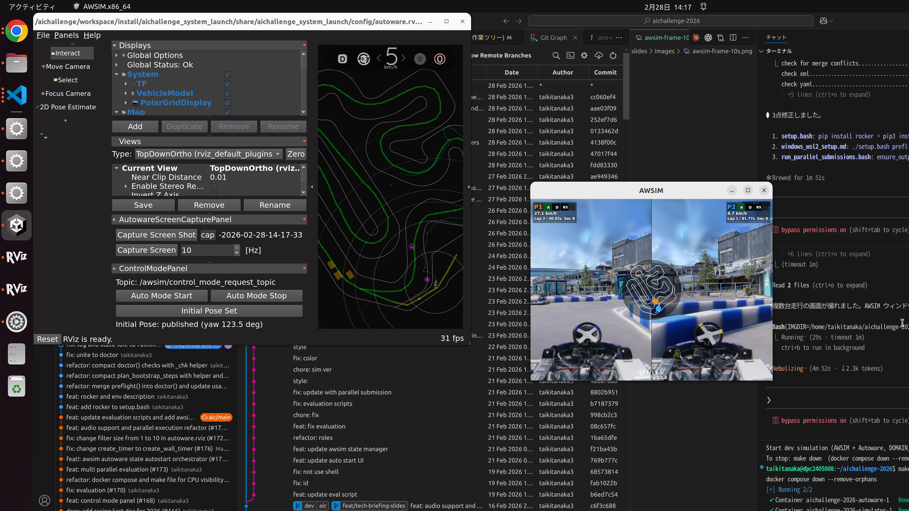

`run_parallel_submissions.bash` で2台が同一コースを同時走行中 — RViz2 に2台分の軌道が表示

---

# まとめ: 何が変わった？（ユーザー視点）

### Before（2025）
```bash
# 手動で色々インストールして...
rocker --nvidia --x11 ... aichallenge-image bash
# コンテナ内で手動ビルド、手動起動...
```

### After（2026）
```bash
# セットアップ
curl -fsSL "https://...setup.bash" | bash

# 開発
make dev          # 起動
make down         # 停止

# 評価
make eval
```

**3コマンドで開発開始、1コマンドで評価完了**

---

# `make dev` で起動するとこうなる

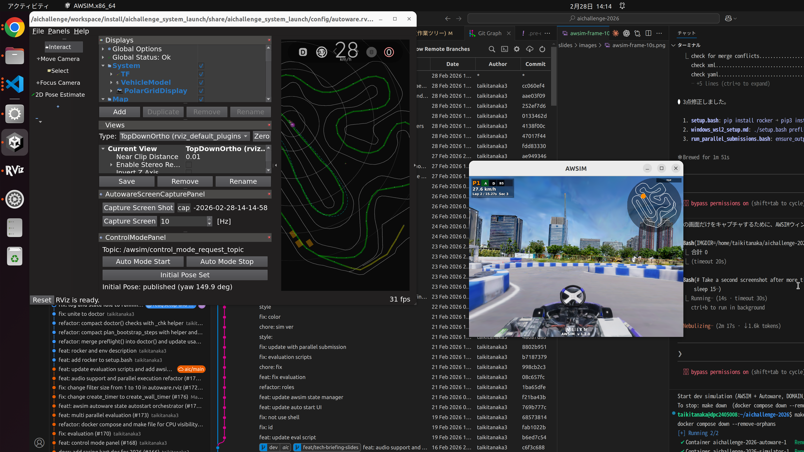

**開発環境の起動** — RViz2（軌道計画可視化） / AWSIM（シミュレーション） / ターミナル（ログ出力）が同時に動作

---

<div class="two-col">

<div class="two-col-left">

# AWSIM Race インターフェース（お試し版）

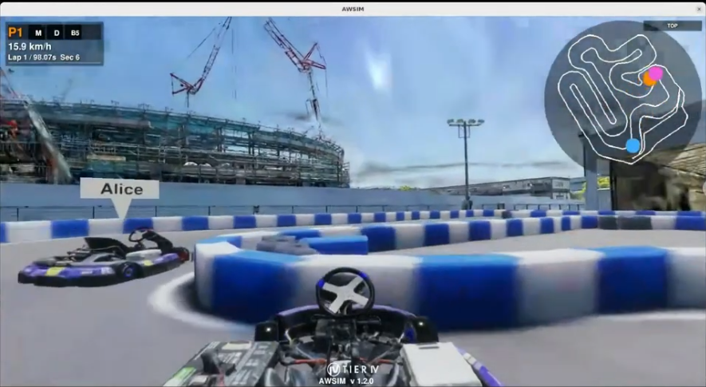

**複数台リアルタイム競走** — 各カートの速度・周回情報をリアルタイム表示・管理

---

## AWSIM シナリオ設定（お試し版）

</div>

<div class="two-col-right">

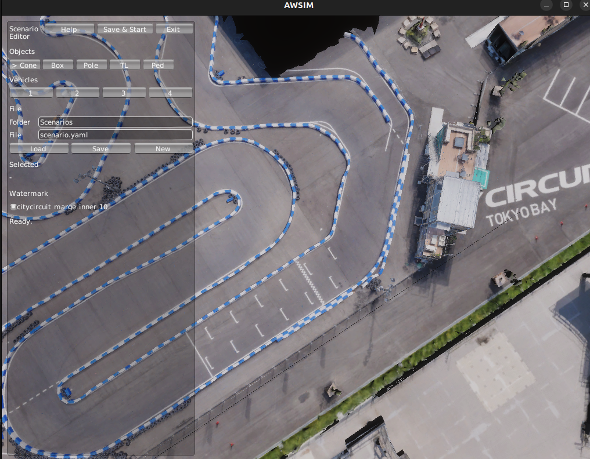

**AWSIM シナリオ設定画面**

</div>

</div>

---

<!-- _class: title -->
<!-- _header: "" -->

# ========== Part 2 開始 ==========
## 新コマンド解説

---

<!-- _header: "Part 2: 新コマンド解説" -->

# セットアップ: curl 1行で始まる

```bash
sudo apt update && sudo apt install -y curl
curl -fsSL "https://raw.githubusercontent.com/AutomotiveAIChallenge/\
aichallenge-racingkart/main/setup.bash" | bash
```

### `setup.bash bootstrap` のフロー

```
curl | bash → 対話形式で y/N 確認しながら進行
  1. 基本パッケージ導入      2. Docker インストール
  3. docker グループ追加      4. リポジトリ clone
  5. 環境診断 (doctor)        6. .env 作成（GPU/CPU 自動検出）
  7. ベースイメージ pull      8. AWSIM ダウンロード
  9. 開発イメージ build      10. ワークスペースビルド
 11. 起動確認
```

---

# setup.bash のサブコマンド

| コマンド | 役割 |
|----------|------|
| `./setup.bash bootstrap` | 対話形式で環境構築を一括実行 |
| `./setup.bash doctor` | 環境診断 — 何が足りないか表示 |
| `./setup.bash env` | `.env` を自動生成（GPU/CPU 検出） |
| `./setup.bash pull image` | Autoware ベースイメージを取得 |
| `./setup.bash download awsim` | AWSIM バイナリをダウンロード・展開 |
| `./setup.bash test` | 一通りのスモークテスト |

### 困ったらまず `doctor`

```bash
./setup.bash doctor
# → Docker ✅ / AWSIM ❌ / Image ✅ ... のように表示
# → 次にやるべきことを教えてくれる
```

---

# Docker Compose & Makefile

### docker-compose.yml（簡潔な構成管理）

```yaml
x-autoware-base: &autoware-base
  image: "aichallenge-2025-dev"
  privileged: true
  network_mode: host
  volumes: [./output:/output, ./aichallenge:/aichallenge]

services:
  autoware: {<<: *autoware-base, command: "run_autoware.bash"}
  simulator: {<<: *autoware-base, command: "run_simulator.bash"}
```

### GPU 切り替え（.env で制御）
```bash
# GPU を使う
COMPOSE_FILE=docker-compose.yml:docker-compose.gpu.yml

# CPU のみ（上の行を削除 or コメントアウト）
```

### よく使う `make` コマンド
```bash
make autoware-build    # ROS ワークスペース build
make dev               # AWSIM + Autoware 起動
make down              # すべて停止
./docker_build.sh dev  # イメージビルド
```

---

# Makefile とは

**「`docker compose ...` の短い入口」**

```
あなたが打つもの         実際に起きること
─────────────          ────────────────────────
make dev            →  docker compose up -d simulator
                       docker compose up -d autoware
make autoware-build →  docker compose run --rm autoware-build
make down           →  docker compose down --remove-orphans
make ps             →  docker compose ps
```

### 命名ルール: `<service>-<command>`
- `autoware-build` — Autoware をビルド
- `autoware-simulator` — Autoware を AWSIM モードで起動
- `simulator-reset` — シミュレータをリセット
- サービス名は `docker-compose.yml` の `services:` に対応

---

# コマンド早見表

| コマンド | 何をする？ | いつ使う？ |
|----------|-----------|-----------|
| `./docker_build.sh dev` | 開発用 Docker イメージを作る | 初回 / Dockerfile 更新後 |
| `make autoware-build` | ROS ワークスペースをビルド | 初回 / ソース更新後 |
| `make dev` | AWSIM + Autoware を起動 | 手元でデバッグしたい時 |
| `make ps` | 起動中コンテナを一覧表示 | 「動いてる？」確認 |
| `make down` | コンテナを停止・片付け | 終了時 / 詰まった時 |
| `make eval` | 単独走行の評価を実行 | 評価を回したい時 |
| `make rviz2` | RViz2 で可視化 | 軌道・点群を見たい時 |

---

# 評価コマンド

### 単体評価
```bash
make eval
# 内部で docker compose up → 走行 → 結果収集 → docker compose down
```

結果は `output/<run_id>/d1/` に保存:
- `result-details.json` — 走行結果 / `capture/` — スクリーンキャプチャ
- `rosbag2_autoware.mcap` — rosbag 記録 / `motion_analytics.html` — モーション分析

### 並列評価（複数チームの提出物を同時走行）
```bash
./run_parallel_submissions.bash \
  --submit submit/team_a.tar.gz submit/team_b.tar.gz
```
- Domain ID 1〜4 で最大4台を同時走行
- 各チームの結果は `output/<run_id>/d<N>/` に分離

---

# AWSIM モード一覧

`run_simulator.bash` が AWSIM の起動パラメータを制御:

| モード | 台数 | 周回 | タイムアウト | 用途 |
|--------|------|------|-------------|------|
| `dev` | 1台 | 600 | 無制限 | 開発・デバッグ |
| `test` | 1台 | 1 | 90秒 | スモークテスト |
| `1p` | 1台 | 6 | 600秒 | 単体評価 |
| `2p` | 2台 | 6 | 600秒 | 2台並列評価 |
| `3p` / `4p` | 3-4台 | 6 | 600秒 | 多台数並列評価 |

```bash
# 例: run_simulator.bash の内部
$AWSIM_DIRECTORY/AWSIM.x86_64 \
  --start-mode sync --vehicles 2 --laps 6 --timeout 600
```

---

# 開発ワークフロー（デモ）

```bash
# 1. セットアップ（初回のみ）
curl -fsSL "https://...setup.bash" | bash
./docker_build.sh dev && make autoware-build

# 2. コード編集（ホスト側）
vim aichallenge/workspace/src/aichallenge_submit/...

# 3. ビルド（コンテナ内で実行される）
make autoware-build

# 4. 起動して確認
make dev

# 5. 動作確認 → 修正 → 再ビルド → 再起動
make down && make autoware-build && make dev

# 6. 評価
make eval
```

---

# AWSIM + RViz2 — 走行画面

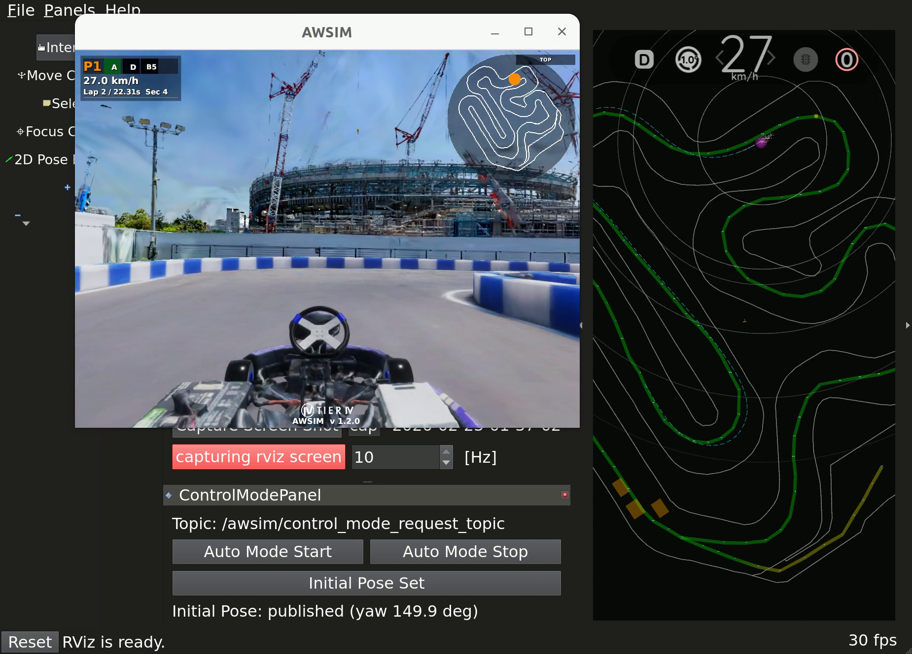

**Lap 2 走行中** — コース後半のコーナリング / 速度: 27 km/h / 軌道追従を可視化

---

# 困ったときの対処法

| エラー | 対処 |
|--------|------|
| `No such image: aichallenge-2025-dev` | `./docker_build.sh dev` |
| `No such file: .../install/setup.bash` | `make autoware-build` |
| GPU エラー (`nvidia driver`) | `.env` で `COMPOSE_FILE` をコメントアウト → CPU 試す |
| 全般的に動かない | `make down` → `./setup.bash doctor` |

### ログ確認
```bash
tail -50 output/latest/d1/autoware.log
```

---

---

<!-- _class: title -->
<!-- _header: "" -->

# ========== Part 3 へ ==========
## 複数台AWSIMアーキテクチャ

---
<!-- _header: "Part 3: 複数台AWSIMアーキテクチャ" -->
<!-- _class: center-all -->

# 複数台走行の実例

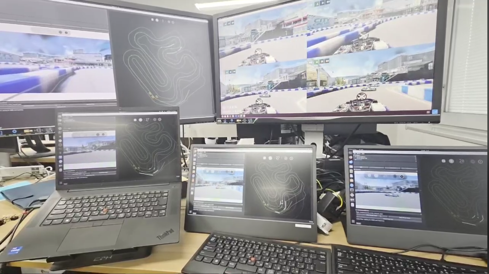

---
<!-- _header: "Part 3: 複数台AWSIMアーキテクチャ" -->

<!-- _class: center-all -->

# 複数台AWSIMアーキテクチャ

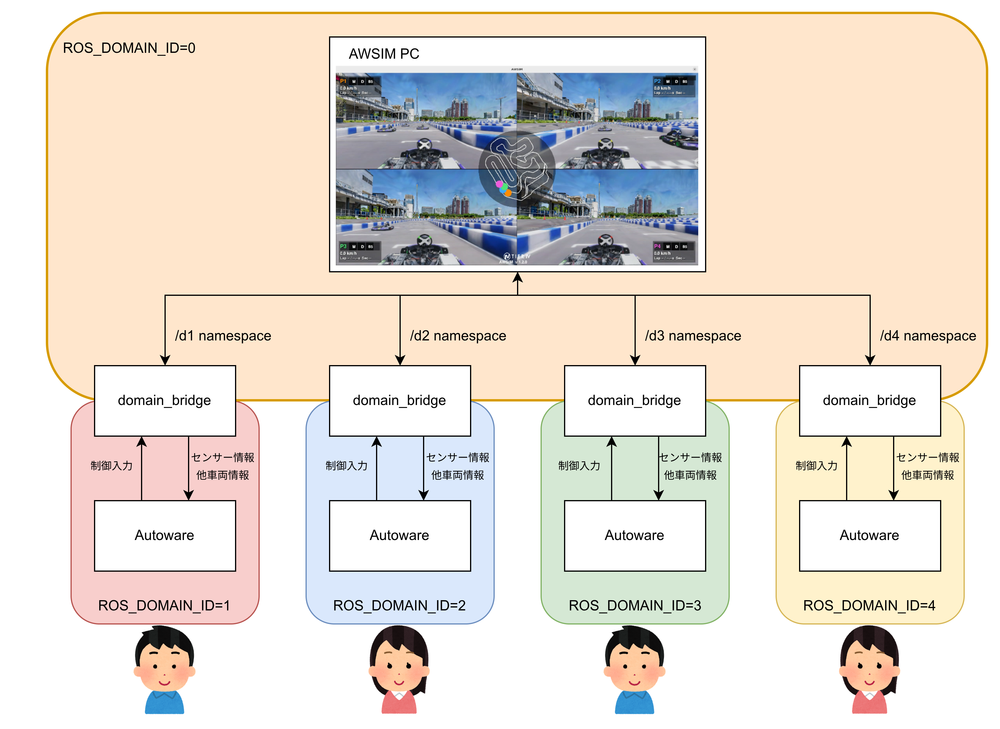


---

<!-- _class: center-all -->

# domain_bridge


---

<!-- _header: "Part 3: 複数台AWSIMアーキテクチャ" -->

# Part 3：1台のPCで複数台対戦

---

<!-- _header: "Part 3: 複数台AWSIMアーキテクチャ" -->


<!-- _class: center-all -->

# Part 3：複数のPCで複数台対戦

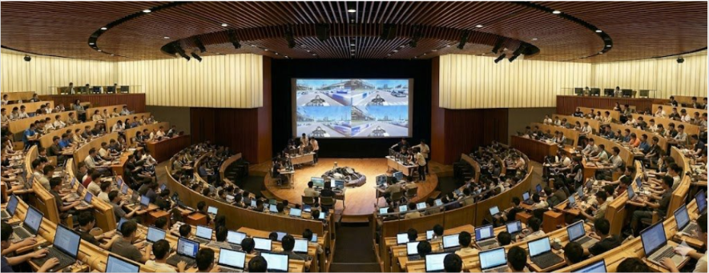


---

<!-- _header: "Part 3: 複数台AWSIMアーキテクチャ" -->


<!-- _class: center-all -->

# Part 3：複数のPCで複数台対戦


---

<!-- _class: title -->
<!-- _header: "" -->

# ========== Part 4 開始 ==========
## End-to-End AI の入門

---

<!-- _header: "Part 4: E2E AI の入門" -->

# Part 4 はじめに：E2E AI とは

### 従来的アプローチ（パイプライン）
```
センサ → 認識 → 計画 → 制御 → 実行
  (各ステップが独立したモジュール)
```

### E2E（End-to-End）アプローチ
```
センサ → ニューラルネット → 制御
  (入力から出力までを一度に学習)
```

### AI チャレンジでの E2E AI
**TinyLiDARNet** — LiDAR スキャン画像から直接 **操舵角 + 加速度** を出力するニューラルネット

---

# TinyLiDARNet の構造

```
入力: LiDAR スキャン（1080点）
  ↓
正規化・前処理
  ↓
small CNN（アーキテクチャ: tiny）
  ├─ Conv1d（カーネル: 3）
  ├─ ReLU
  └─ Linear（隠れ層: 64）
  ↓
出力層: 2 ユニット（操舵角, 加速度）
  ↓
制御信号 → Autoware 互換形式で AWSIM へ
```

### パラメータ数
- わずか **~5k parameters** — エッジデバイスでの推論が可能
- 推論時間: **< 50ms** （ROS 2 ノードとして実行）

---

# TinyLiDARNet の学習フロー

```bash
# 1. データ収集
cd aichallenge/ml_workspace
./record_data.bash

# 2. データ抽出（rosbag → CSV）
python tiny_lidar_net/extract_data_from_bag.py \
  --bags-dir ./rawdata --outdir ./datasets

# 3. モデル学習
python tiny_lidar_net/train_tiny_lidar_net.py \
  --train-data datasets/train.csv --epochs 100

# 4. 推論実行
ros2 launch tiny_lidar_net_controller tiny_lidar_net.launch.xml
```

### コンテスト戦略
1. **Week 1-2**: Pure Pursuit で基盤構築
2. **Week 3-4**: データ収集（TinyLiDARNet 学習用）
3. **Week 5-8**: モデル開発・最適化
4. **Week 9-10**: 最終調整・提出

---

<!-- _header: "クロージング" -->

# セッション全体のまとめ

### Part 1: 変更点概要 & できるようになったこと
- CPU 環境でも AWSIM が動作 / `curl` 1行でセットアップ
- Docker Compose で統一 / 複数台対応

### Part 2: 新コマンド解説
- `setup.bash doctor` で環境診断
- `make dev` / `make eval` で完結

### Part 3: 複数台アーキテクチャ
- Domain ID で最大4台の並列走行
- domain_bridge で通信空間を分離・中継

### Part 4: E2E AI
- TinyLiDARNet で NN ベース制御を実装
- `ml_workspace/` で学習パイプラインをカスタマイズ可能

---

<!-- _class: title -->
<!-- _header: "" -->

# 🎯 次のステップ

```bash
# 1. セットアップ
curl -fsSL "https://raw.githubusercontent.com/\
AutomotiveAIChallenge/aichallenge-racingkart/\
main/setup.bash" | bash

# 2. 環境診断
./setup.bash doctor

# 3. 開発開始
make dev
```

---

<!-- _class: title -->
<!-- _header: "" -->

# Q&A

ご質問・フィードバックをお待ちしています

---

# 参考リソース

- **リポジトリ**: `github.com/AutomotiveAIChallenge/aichallenge-racingkart`
