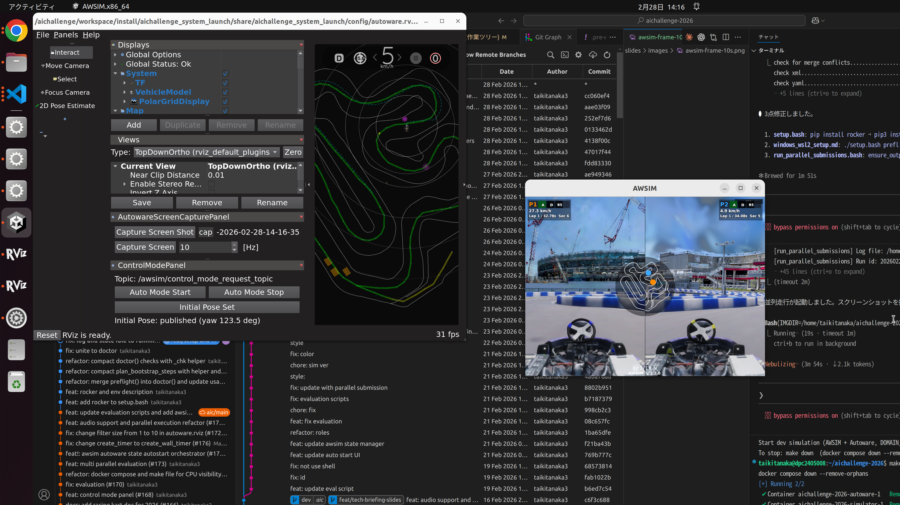

<!-- _class: title -->
<!-- _header: "" -->

# 技術解説会
## 来年度大会の変更点概要 & 新コマンド解説

**自動運転AIチャレンジ 2026**

2026.02.28

---

# AWSIM シミュレータの走行画面


左: AWSIM（3D レーシングカートシミュレータ）/ 右: RViz2（地図・軌道の可視化）

---

# 今日のアジェンダ

### Part 1: 変更点概要
- 2025 → 2026 で何が変わった？
- 変更の動機（なぜ変えた？）
- アーキテクチャ概観 / Domain ID / GPU切替 / ログ / 評価フロー

### Part 2: 新コマンド解説
- `setup.bash` — curl 1行で始まるセットアップ
- Docker Compose / Makefile — コマンド体系
- 評価コマンド / 開発ワークフロー
- よくある詰まりと解決策

---

<!-- _header: "Part 1: 変更点概要" -->

# 2025 → 2026 変更サマリ

| 項目 | 2025 | 2026 |
|------|------|------|
| コンテナ起動 | `rocker` コマンド | **Docker Compose** |
| ビルド | ホスト or コンテナ | **コンテナ内のみ** |
| 複数台同時走行 | 非対応 | **Domain ID で最大4台** |
| セットアップ | 手動で複数手順 | **`curl ... \| bash` 1行** |
| GPU/CPU 切替 | 起動オプション | **`.env` の1行** |
| 評価 | 手動実行 | **`run_evaluation.bash` 一括** |
| ログ出力 | バラバラ | **`output/<run_id>/d<N>/` に統一** |
| 操作の入口 | 複数スクリプト | **`make` コマンド** |

---

# 変更の動機

### rocker の課題
- 環境差異でハマりやすい（NVIDIA ドライバ、X11、権限...）
- 複数コンテナの協調が難しい / 「何が動いているか」見えにくい

### やりたかったこと
- **コピペで完結**: 初心者でも迷わない
- **複数台対応**: 同一マシンで複数カートを並列走行
- **再現性**: 誰がやっても同じ結果になる環境

### 解決策
**Docker Compose + Makefile + setup.bash**
→ 宣言的な構成管理 + 短いコマンド + 自動セットアップ

---

# アーキテクチャ概観

```
┌─── ホスト（あなたのPC）────────────────────────┐
│                                                  │
│  make dev / run_evaluation.bash                  │
│      ↓                                           │
│  docker compose up                               │
│      ↓                                           │
│  ┌──────────────┐    ┌──────────────┐            │
│  │  simulator   │    │   autoware   │            │
│  │  (AWSIM)     │◄──►│  (ROS2)     │            │
│  │  Domain ID=0 │    │  Domain ID=1│            │
│  └──────────────┘    └──────────────┘            │
│                                                  │
│  output/<run_id>/d1/  ← ログ・結果               │
└──────────────────────────────────────────────────┘
```

- **ホスト**: `make` / シェルスクリプトを実行するだけ
- **コンテナ内**: AWSIM・Autoware が動作、ビルドもここ

---

# Domain ID による分離

```
         ┌─────────────────────┐
         │     AWSIM           │
         │   ROS_DOMAIN_ID=0   │
         └──┬───┬───┬───┬──────┘
            │   │   │   │  domain_bridge
            ▼   ▼   ▼   ▼
         ┌──┐ ┌──┐ ┌──┐ ┌──┐
         │D1│ │D2│ │D3│ │D4│   ← Autoware インスタンス
         └──┘ └──┘ └──┘ └──┘
```

- **AWSIM** は常に `ROS_DOMAIN_ID=0` で動作
- **Autoware** は `ROS_DOMAIN_ID=1..4` で起動
- `domain_bridge` が ID 間のトピックを中継
- 同一マシンで **最大4台の並列走行** が可能

```bash
DOMAIN_ID=2 make dev   # 例: Domain ID 2 で起動
```

---

# 複数台走行 — 実際の画面



AWSIM の4分割ビュー（2台 x 2カメラ）— 各カートが独立した Autoware で自動走行

---

# GPU / CPU 切り替え

`.env` ファイルの **1行だけ** で制御:

```bash
# GPU モード（デフォルト）
COMPOSE_FILE=docker-compose.yml:docker-compose.gpu.yml

# CPU モード: 上の行を削除 or コメントアウト
# COMPOSE_FILE=docker-compose.yml:docker-compose.gpu.yml
```

### 仕組み
- `docker-compose.yml` — CPU ベースの定義
- `docker-compose.gpu.yml` — GPU overlay（NVIDIA デバイス予約を追加）
- Docker Compose の **複数ファイルマージ** 機能を利用

### いつ CPU を使う？
GPU なし環境での動作確認 / CI・テスト環境 / 「まず動くか」の確認

---

# ディレクトリ構成 — 統一ログ出力

```
output/
├── 20260225-234959/         ← run_id（タイムスタンプ）
│   ├── d1/                  ← Domain ID 1
│   │   ├── autoware.log
│   │   ├── awsim.log
│   │   ├── result-details.json
│   │   ├── capture/         ← スクリーンキャプチャ
│   │   └── rosbag2_autoware.mcap
│   ├── d2/                  ← Domain ID 2（並列時）
│   └── d3/
├── latest/                  ← 最新 run へのシンボリックリンク
│   └── d1 → ../20260225-.../d1
└── docker/                  ← Docker ビルドログ
```

- **タイムスタンプ + Domain ID** で一意に識別
- `output/latest/` で「最新の結果」にすぐアクセス

---

# 評価フロー

### 単体評価（1台）
```bash
./run_evaluation.bash        # 起動→待機→走行→結果収集→停止
./run_evaluation.bash test   # 短いスモークテスト
```

### 並列評価（複数提出物を同時走行）
```bash
./run_parallel_submissions.bash \
  --submit submit/team_a.tar.gz submit/team_b.tar.gz
```

### 評価オーケストレータがやること
1. AWSIM 起動 & 準備完了を待機
2. Autoware 起動 & 初期位置設定
3. 走行開始 → 終了判定を監視
4. ログ・rosbag・キャプチャを収集
5. コンテナ停止 & クリーンアップ

---

# 並列評価 — 複数台が同時に走る


`run_parallel_submissions.bash` で2台が同一コースを同時走行中 — RViz2 に2台分の軌道が表示

---

# まとめ: 何が変わった？（ユーザー視点）

### Before（2025）
```bash
# 手動で色々インストールして...
rocker --nvidia --x11 ... aichallenge-image bash
# コンテナ内で手動ビルド、手動起動...
```

### After（2026）
```bash
# セットアップ
curl -fsSL "https://...setup.bash" | bash

# 開発
make dev          # 起動
make down         # 停止

# 評価
./run_evaluation.bash
```

**3コマンドで開発開始、1コマンドで評価完了**

---

# `make dev` で起動するとこうなる


`make dev` 実行後のデスクトップ — 左: RViz2 / 右上: AWSIM / 右下: エディタ

---

# AWSIM シナリオ設定


AWSIM の UI パネル — ControlModePanel / CapturePanel / View 設定
コマンドラインで `--vehicles`, `--laps`, `--timeout`, `--start-mode` を制御

---

<!-- _header: "Part 2: 新コマンド解説" -->

# セットアップ: curl 1行で始まる

```bash
sudo apt update && sudo apt install -y curl
curl -fsSL "https://raw.githubusercontent.com/AutomotiveAIChallenge/\
aichallenge-racingkart/main/setup.bash" | bash
```

### `setup.bash bootstrap` のフロー

```
curl | bash → 対話形式で y/N 確認しながら進行
  1. 基本パッケージ導入      2. Docker インストール
  3. docker グループ追加      4. リポジトリ clone
  5. 環境診断 (doctor)        6. .env 作成（GPU/CPU 自動検出）
  7. ベースイメージ pull      8. AWSIM ダウンロード
  9. 開発イメージ build      10. ワークスペースビルド
 11. 起動確認
```

---

# setup.bash のサブコマンド

| コマンド | 役割 |
|----------|------|
| `./setup.bash bootstrap` | 対話形式で環境構築を一括実行 |
| `./setup.bash doctor` | 環境診断 — 何が足りないか表示 |
| `./setup.bash env` | `.env` を自動生成（GPU/CPU 検出） |
| `./setup.bash pull image` | Autoware ベースイメージを取得 |
| `./setup.bash download awsim` | AWSIM バイナリをダウンロード・展開 |
| `./setup.bash test` | 一通りのスモークテスト |

### 困ったらまず `doctor`

```bash
./setup.bash doctor
# → Docker ✅ / AWSIM ❌ / Image ✅ ... のように表示
# → 次にやるべきことを教えてくれる
```

---

# Docker Compose とは

**「`docker run` の設定ファイル版」**

### docker run の課題
```bash
# 毎回こんなの打つの...？
docker run --rm -it --privileged --network host \
  -v ./output:/output -v ./aichallenge:/aichallenge \
  -e DISPLAY=$DISPLAY -e ROS_DOMAIN_ID=1 \
  aichallenge-2025-dev bash -c "..."
```

### Docker Compose なら
```yaml
# docker-compose.yml に書いておけば...
services:
  autoware:
    image: "aichallenge-2025-dev"
    network_mode: host
    volumes: [./output:/output, ./aichallenge:/aichallenge]
```
```bash
docker compose up -d autoware   # これだけ！
```

---

# docker-compose.yml の読み方

```yaml
x-autoware-base: &autoware-base    # ← アンカー（共通設定）
  image: "aichallenge-2025-dev"
  privileged: true
  pull_policy: never                # ← ローカルイメージのみ使用
  network_mode: host
  volumes: [./output:/output, ./aichallenge:/aichallenge]

services:
  autoware:                         # ← サービス名
    <<: *autoware-base              # ← アンカーを展開
    command: ["bash", "-lc", "..."]

  simulator:
    <<: *autoware-base
    command: ["bash", "-lc", "exec /aichallenge/run_simulator.bash ..."]

  autoware-build:
    <<: *autoware-base
    command: ["bash", "-lc", "exec bash /aichallenge/build_autoware.bash"]
```

`&autoware-base` / `*autoware-base` = **YAML アンカー**（コピペ削減）

---

# docker-compose.gpu.yml — GPU overlay

```yaml
x-gpu: &gpu
  environment:
    - NVIDIA_VISIBLE_DEVICES=all
    - NVIDIA_DRIVER_CAPABILITIES=all
  deploy:
    resources:
      reservations:
        devices:
          - driver: nvidia
            count: all
            capabilities: ["gpu"]

services:
  autoware:
    <<: *gpu          # ← autoware に GPU 設定を追加
  simulator:
    <<: *gpu          # ← simulator にも
```

`.env` の `COMPOSE_FILE` でベースとマージ: `COMPOSE_FILE=docker-compose.yml:docker-compose.gpu.yml`

---

# docker_build.sh — イメージビルド

### 開発イメージ
```bash
./docker_build.sh dev
# → aichallenge-2025-dev イメージを作成（Autoware ベース + ツール追加）
```

### 評価イメージ（提出物を含む）
```bash
./create_submit_file.bash              # 提出用 tar を作成
./docker_build.sh eval --submit <tar>  # 提出物を含むイメージを作成
```

### ポイント
- `pull_policy: never` → Docker Hub から pull しない → **先にローカルでビルドが必要**
- ビルドログ: `output/docker/<timestamp>-docker_build-<pid>.log`

---

# Makefile とは

**「`docker compose ...` の短い入口」**

```
あなたが打つもの         実際に起きること
─────────────          ────────────────────────
make dev            →  docker compose up -d simulator
                       docker compose up -d autoware
make autoware-build →  docker compose run --rm autoware-build
make down           →  docker compose down --remove-orphans
make ps             →  docker compose ps
```

### 命名ルール: `<service>-<command>`
- `autoware-build` — Autoware をビルド
- `autoware-simulator` — Autoware を AWSIM モードで起動
- `simulator-reset` — シミュレータをリセット
- サービス名は `docker-compose.yml` の `services:` に対応

---

# コマンド早見表

| コマンド | 何をする？ | いつ使う？ |
|----------|-----------|-----------|
| `./docker_build.sh dev` | 開発用 Docker イメージを作る | 初回 / Dockerfile 更新後 |
| `make autoware-build` | ROS ワークスペースをビルド | 初回 / ソース更新後 |
| `make dev` | AWSIM + Autoware を起動 | 手元でデバッグしたい時 |
| `make ps` | 起動中コンテナを一覧表示 | 「動いてる？」確認 |
| `make down` | コンテナを停止・片付け | 終了時 / 詰まった時 |
| `./run_evaluation.bash` | 単独走行の評価を実行 | 評価を回したい時 |
| `./run_evaluation.bash test` | スモークテスト | まず動くか確認 |
| `make rviz2` | RViz2 で可視化 | 軌道・点群を見たい時 |

---

# 評価コマンド

### 単体評価
```bash
./run_evaluation.bash
# 内部で docker compose up → 走行 → 結果収集 → docker compose down
```

結果は `output/<run_id>/d1/` に保存:
- `result-details.json` — 走行結果 / `capture/` — スクリーンキャプチャ
- `rosbag2_autoware.mcap` — rosbag 記録 / `motion_analytics.html` — モーション分析

### 並列評価（複数チームの提出物を同時走行）
```bash
./run_parallel_submissions.bash \
  --submit submit/team_a.tar.gz submit/team_b.tar.gz
```
- Domain ID 1〜4 で最大4台を同時走行
- 各チームの結果は `output/<run_id>/d<N>/` に分離

---

# AWSIM シナリオモード一覧

`run_simulator.bash` が AWSIM の起動パラメータを制御:

| モード | 台数 | 周回 | タイムアウト | 用途 |
|--------|------|------|-------------|------|
| `dev` | 1台 | 600 | 無制限 | 開発・デバッグ |
| `test` | 1台 | 1 | 90秒 | スモークテスト |
| `1p` | 1台 | 6 | 600秒 | 単体評価 |
| `2p` | 2台 | 6 | 600秒 | 2台並列評価 |
| `3p` / `4p` | 3-4台 | 6 | 600秒 | 多台数並列評価 |

```bash
# 例: run_simulator.bash の内部
$AWSIM_DIRECTORY/AWSIM.x86_64 \
  --start-mode sync --vehicles 2 --laps 6 --timeout 600
```

---

# 開発ワークフロー（デモ）

```bash
# 1. セットアップ（初回のみ）
curl -fsSL "https://...setup.bash" | bash
./docker_build.sh dev && make autoware-build

# 2. コード編集（ホスト側）
vim aichallenge/workspace/src/aichallenge_submit/...

# 3. ビルド（コンテナ内で実行される）
make autoware-build

# 4. 起動して確認
make dev

# 5. 動作確認 → 修正 → 再ビルド → 再起動
make down && make autoware-build && make dev

# 6. 評価
./run_evaluation.bash
```

---

# AWSIM + RViz2 画面


Lap 2 走行中 — コース後半のコーナリングシーン（27 km/h）

---

# よくある詰まりと解決策

### `pull_policy: never` 的なエラー
```
Error: No such image: aichallenge-2025-dev
```
→ **`./docker_build.sh dev`** でイメージをビルド

### `.../install/setup.bash` が無い
```
bash: /aichallenge/workspace/install/setup.bash: No such file
```
→ **`make autoware-build`** でワークスペースをビルド

### とにかく動かなくなった / 環境がおかしい
→ **`make down`** で全停止 → **`./setup.bash doctor`** で診断

---

# よくある詰まりと解決策（続き）

### GPU 関連のエラー
```
could not select device driver "nvidia"
```
→ `.env` で `COMPOSE_FILE` 行をコメントアウトして CPU モードで確認

### Domain ID の衝突
- `make ps` で起動中コンテナを確認 → `make down` で全停止

### ログの確認
```bash
ls output/latest/d1/          # 最新の実行結果
tail -50 output/latest/d1/autoware.log
```

---

<!-- _header: "クロージング" -->

# 参考リンク・ドキュメント

| ドキュメント | 内容 |
|-------------|------|
| `design_docs/introduction.md` | コマンド早見表（初学者向け） |
| `design_docs/how_to_setup.md` | セットアップ手順 |
| `design_docs/makefile_target_naming.md` | Makefile 命名規則 |
| `design_docs/log_design.md` | ログ出力の設計 |
| `design_docs/run_parallel_submissions.md` | 並列評価の詳細 |
| `aichallenge/README.md` | スクリプト設計方針 |

### 外部リンク
- [大会公式サイト](https://www.jsae.or.jp/jaaic/) / [Autoware ドキュメント](https://autowarefoundation.github.io/autoware-documentation/)

---

# 次のセッション予告

### AWSIM 複数台アーキテクチャ（久保田）
- AWSIM 側の複数車両管理の仕組み
- Domain Bridge の詳細設計 / パフォーマンスチューニング

### E2E AI（新田）
- End-to-End 自動運転 AI の概要
- 学習パイプラインの構築 / `ml_workspace/` の使い方

---

<!-- _class: title -->
<!-- _header: "" -->

# Q&A

ご質問・フィードバックをお待ちしています

---

リポジトリ: `github.com/AutomotiveAIChallenge/aichallenge-racingkart`

まずは `./setup.bash doctor` から始めてみてください
