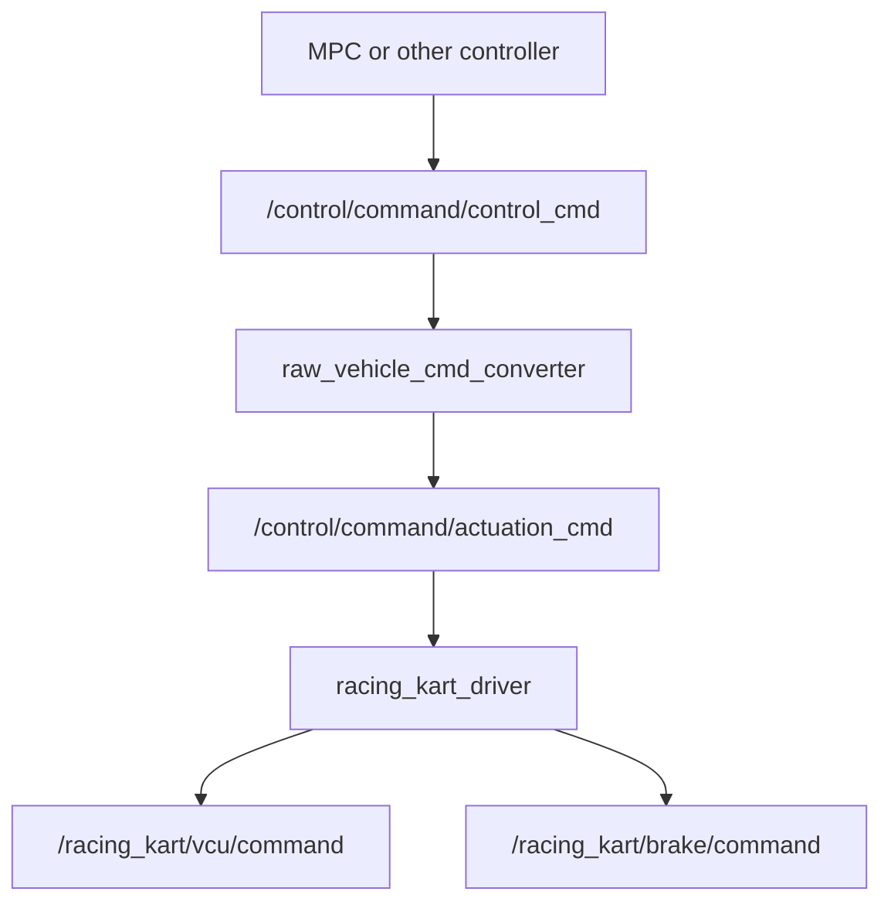
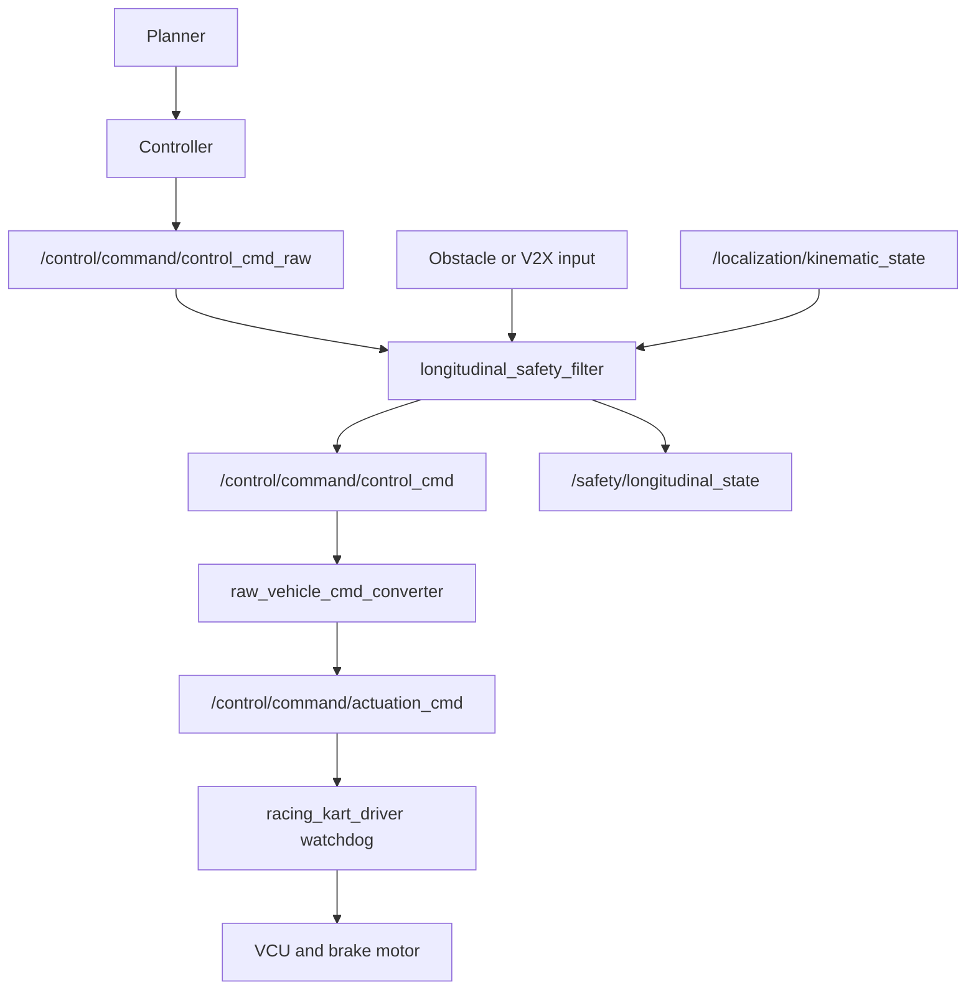
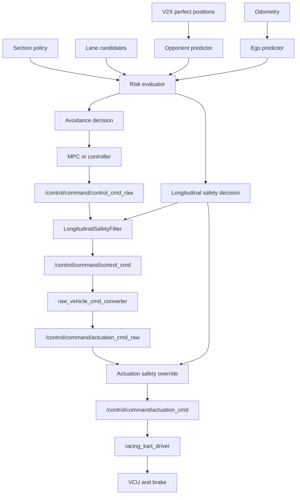

# Longitudinal Safety Design

## Purpose

この文書は、前方障害物に対する減速・停止をどこで実装すべきかを整理するための設計メモである。

結論として、MPC package内の実装は設計検証用の暫定層に留めるべきである。競技走行で安全停止を成立させるには、controllerから独立した `longitudinal_safety_filter` と、最終段に近いdriver/watchdogの二段構成が望ましい。

## Current MPC Control Structure

`multi_purpose_mpc_ros/src/mpc_controller_cpp.cpp` のMPCは、空間モデルのQPとして構成されている。

- 状態: `[e_y, e_psi, t]`
- 入力: `[v, kappa]`
- 横制御: `e_y`, `e_psi` を抑えるように `kappa` を最適化し、最後に操舵角へ変換する。
- 縦制御: QPは速度 `v` を出すが、加速度やブレーキ量は最適化していない。
- 後処理: `MpcControllerCpp::control()` で `kp * (v_cmd - actual_v)` からaccelerationを作り、`a_min/a_max` でclampしている。

つまり、現状MPCは「横追従 + 速度目標生成」に近く、停止距離を保証する縦制御MPCではない。

## Why 3m/1m Is Not Enough

20km/hは約5.56m/sである。停止距離は単純化しても次の式になる。

```text
d_stop = v^2 / (2 * a)
```

代表値では以下の距離が必要になる。

| deceleration | stopping distance from 20km/h |
| --- | ---: |
| `1.6 m/s^2` current MPC `a_min` | `9.6m` |
| `2.5 m/s^2` simulation brake map maximum | `6.2m` |
| `2.9 m/s^2` real kart brake map around 20km/h | `5.3m` |

実際には認識遅れ、通信遅れ、converter遅れ、actuator応答遅れ、タイヤ/路面条件が入るため、さらにmarginが必要になる。したがって「3mで10km/h、1mで停止」は20km/h走行時の安全停止条件としては遅すぎる。

## Review of Current MPC-Internal Safety

現在のMPC内safety実装は、選択中laneの `front_block_distance_m` と現在速度から停止距離を計算し、`u[0]` とaccelerationを上書きする構造である。

これは挙動確認には有効だが、安全設計としては以下の限界がある。

- C++ MPCが動いている時しか効かない。
- pure pursuitや他controllerには効かない。
- MPC nodeが停止・遅延した場合に停止側へ倒れない。
- `raw_vehicle_cmd_converter` や `racing_kart_driver` 以降の異常には効かない。
- safety状態が主にRViz text markerに埋まっており、減速兆候をtopicとして監視しにくい。
- selected laneのみを見ると、回避可能な場合は減速せずlane changeを優先するため、「前方障害物に対して減速している」兆候が見えないことがある。

特に最後の点は重要である。lane selectionとlongitudinal safetyを同じ判断に閉じ込めると、「回避できるから減速しない」のか「そもそも障害物を認識していない」のかを観測しにくい。

## Existing Command Path

現在の車両指令は次の経路を通る。



`aichallenge_submit_launch/launch/reference.launch.xml` では `raw_vehicle_cmd_converter` が `AckermannControlCommand` を `ActuationCommand` に変換している。`racing_kart_driver_node.cpp` では、autonomous mode中に `actuation.accel_cmd` と `actuation.brake_cmd` をそれぞれthrottle/brake commandへ変換している。

driverにはjoystick timeoutやemergency時のfull brakeはあるが、前方障害物やcontrol command timeoutに基づく独立した自動停止watchdogはない。

## Candidate Safety Layers

| layer | advantage | limitation | recommendation |
| --- | --- | --- | --- |
| MPC package internal | 実装が速い。選択laneやMPC状態に直接アクセスできる。 | controller依存。MPC停止時に効かない。他controllerに効かない。 | 暫定検証用に限定する。 |
| `/control/command/control_cmd` filter | controller非依存にしやすい。速度・加速度指令を共通に監視できる。 | brake_cmdを直接保証できない。converter map依存が残る。 | 第一段階の本命。 |
| `/control/command/actuation_cmd` filter | throttle/brakeを直接上書きできる。停止保証に近い。 | converter後段なので車両依存が強い。steerとの整合設計が必要。 | 第二段階で追加する。 |
| `racing_kart_driver` watchdog | 最終段に近く、full brakeを出せる。MPC停止にも強い。 | planner contextやlane contextを持ちにくい。 | 実車安全として必須。 |

## Recommended Architecture

推奨は、MPC内部ではなくcontroller後段に独立した `longitudinal_safety_filter` を置く構成である。



この構成では、MPCやpure pursuitは「通常制御」を出し、safety filterがその後段で縦方向だけを上書きする。これにより、controllerの種類に依存せず同じ安全停止判断を適用できる。

## Longitudinal Safety Filter Policy

`longitudinal_safety_filter` は次の入力を購読する。

- `/control/command/control_cmd_raw`: controllerの通常出力
- `/localization/kinematic_state`: 現在速度
- `/v2x/vehicle_positions` または障害物topic: 前方障害物
- optional: selected lane / predicted path / ego corridor

出力は次とする。

- `/control/command/control_cmd`: safety適用後の制御指令
- `/safety/longitudinal_state`: safety状態、前方距離、停止距離、上書き理由
- `/safety/longitudinal_debug`: markerまたはdiagnostic

状態は最低限以下を持つ。

- `CLEAR`: safety介入なし
- `SLOWDOWN`: 停止距離margin内。速度と加速度を連続的に制限
- `BRAKE`: emergency decelが必要。負加速度を明示的に要求
- `EMERGENCY_STOP`: hard stop領域。速度0、最大制動要求

判定式は速度依存にする。

```text
warning_distance = v^2 / (2 * comfortable_decel) + v * latency_margin_s + distance_margin_m
brake_distance   = v^2 / (2 * emergency_decel)   + v * latency_margin_s + distance_margin_m
```

`d_front <= warning_distance` で減速開始、`d_front <= brake_distance` で強制制動、`d_front <= hard_stop_distance` で停止要求とする。

## Acc vs Brake Policy

安全停止の主役はbrakeに置く。理由は、`AckermannControlCommand` のaccelerationはあくまでconverterへの要求値であり、最終的な停止保証は `ActuationCommand` の `brake_cmd` とdriver側のbrake commandで決まるためである。

既存map上も、brakeは明確な負加速度を持っている。

| target | map evidence | implication |
| --- | --- | --- |
| simulation brake | `aichallenge_submit_launch/data/brake_map.csv` で brake ratio `1.0` が約 `-2.5m/s^2` | simulationでは最大brakeを使えば20km/hから約6.2mで停止可能な目安になる。 |
| real kart brake | `racing_kart_launch/data/brake_map.csv` で20km/h付近、brake ratio `0.8` が約 `-2.9m/s^2` | 実車ではbrake ratioを直接支配する層が停止保証に近い。 |
| acceleration command | `AckermannControlCommand.longitudinal.acceleration` | control_cmd段ではbrakeを直接持てないため、負accelerationとして要求する。 |

したがって、制御出力は層ごとに分ける。

- `control_cmd` filter: `speed` と `acceleration` を上書きする。ここでは `acceleration < 0` を出す。
- `actuation_cmd` filter: `accel_cmd = 0` を保証し、必要な `brake_cmd` を直接上書きする。
- driver watchdog: command timeoutやemergency時に `publish_stop_brake_command()` 相当のfull brakeへ落とす。

通常減速ではaccelerationの負値で十分だが、`BRAKE` 以上ではbrakeが支配的であるべきである。`EMERGENCY_STOP` ではaccel/brakeを曖昧に混ぜず、throttleを切り、brake commandを明示的に出す。

## Race-Oriented Safety Policy

今回の前提では、一般的な障害物停止よりもレース向けの「回避優先 safety」として設計する。

前提:

- 他車位置は完全に送られてくる。
- 他車の行動予測が可能である。
- 自車の将来軌跡も推定可能である。
- 経路は基本的にコースに沿って進む。
- レースなので停止より回避を優先する。
- 現状の回避候補はsectionで限定される。
- 5km/h以下は復帰、再加速、詰まり挙動のリスクがある。

基本方針:

- safe lane判定は、全laneではなく `current section` の `allowed_lanes` に限定して行う。
- `allowed_lanes` の中にsafe laneがあるなら、停止ではなく回避する。
- `allowed_lanes` の中にsafe laneがあるがTTCが短い場合は、回避と減速を併用する。
- `allowed_lanes` の中にsafe laneがなく、collision corridorが残る場合だけ強いbrakeへ入る。
- section外では原則として通常走行laneを維持し、明示的に許可されていない壁寄り回避は使わない。
- 通常回避中は `min_race_speed = 5km/h` を下回らせない。
- 5km/h未満または完全停止は、不可避衝突、hard stop、driver emergency時に限定する。
- 停止後の復帰は、前方安全距離が回復し、selected laneが再びsafeになり、一定時間riskが低い場合だけ許可する。

状態の意味は以下とする。

| state | racing behavior | longitudinal output |
| --- | --- | --- |
| `CLEAR` | sectionで許可された候補に十分な安全余裕がある。 | controller出力を通す。 |
| `AVOID` | sectionで許可されたsafe laneへlane changeできる。 | 原則減速しない。必要なら軽い速度capのみ。 |
| `AVOID_WITH_SLOWDOWN` | sectionで許可されたsafe laneはあるがTTCが短い。 | `min_race_speed` 以上を保ちながら減速。 |
| `BRAKE_FOR_COMMIT` | commit point以降で安全なlane changeが難しい。 | emergency decel相当を要求。 |
| `EMERGENCY_STOP` | collisionが不可避、またはhard stop領域。 | throttle cut + max safe brake。 |

## Prediction-Based Risk Evaluation

現在距離だけではなく、時系列予測でリスクを判定する。V2X位置が完全に来る前提なので、相手車両の状態推定を強く使う。

入力:

- ego state: position, yaw, velocity
- selected or candidate lane trajectories
- opponent state: position, yaw, velocity, optional intended lane
- section policy: allowed lanes and commit points

各candidate laneについて、時刻 `t = 0..T` で以下を計算する。

```text
ego_pose_i(t)      = ego predictor(candidate_lane_i, t)
opponent_pose_j(t) = opponent predictor(vehicle_j, t)
distance_ij(t)     = distance(ego_pose_i(t), opponent_pose_j(t))
risk_ij(t)         = distance_ij(t) - safety_radius
```

判定指標:

- `min_distance`: horizon内の最小距離
- `TTC`: `risk <= 0` になる最初の時刻
- `time_margin`: lane change完了予測時刻とTTCの差
- `stop_margin`: `front_distance - required_stop_distance`
- `section_margin`: commit pointまでの残距離

候補laneの分類:

| class | condition | action |
| --- | --- | --- |
| `SAFE` | horizon内でcollisionなし、time_marginあり | lane候補として採用 |
| `RISKY` | collisionは避けられるがtime_marginが小さい | 採用可能だが減速併用 |
| `BLOCKED` | collision corridorが残る | lane候補から除外 |
| `COMMITTED` | commit point以降でlane change不可 | lane維持しbrake判定へ |

この分類により、「障害物が見えていない」のか「見えているが回避で処理している」のかをtopicで分離できる。

## Section-Aware Avoidance Constraints

現状はsectionで回避候補が限定されるため、安全判定もsectionを明示的に持つべきである。

sectionごとに持つべき設定:

- `allowed_lanes`: `center`, `left_wall`, `right_wall` の候補集合
- `preferred_lane`: 通常時に戻すlane
- `entry_blend_distance`: section開始前の遷移距離
- `exit_blend_distance`: section終了時の復帰距離
- `commit_distance`: これ以降はlane変更を諦める距離
- `avoid_with_slowdown_ttc`: 減速併用へ入るTTC
- `brake_ttc`: 強制brakeへ入るTTC
- `min_race_speed_kmh`: 通常回避中に維持する最低速度

section内の判断順序:

1. allowed lanesを生成する。
2. 各laneでego/opponent予測を評価する。
3. `SAFE` laneがあれば、最速で通れるlaneを選ぶ。
4. `RISKY` laneしかなければ、lane選択 + slowdownを併用する。
5. commit point以降でlane変更不能なら、brake policyへ移る。
6. すべて `BLOCKED` なら、brakeまたはemergency stopへ移る。

これにより、section制約下でも「回避優先」と「不可避時停止」を同じrisk評価で扱える。

## Concrete Control Outputs

各層の出力を明確に分ける。

### `control_cmd` filter

目的は減速兆候とcontroller非依存の速度制限である。

- `CLEAR`: raw commandを通す。
- `AVOID`: raw commandを原則通す。
- `AVOID_WITH_SLOWDOWN`: `speed <= safe_speed_limit`、`acceleration <= -comfortable_decel`。
- `BRAKE_FOR_COMMIT`: `speed <= safe_speed_limit`、`acceleration <= -emergency_decel`。
- `EMERGENCY_STOP`: `speed = 0`、`acceleration <= -max_brake_decel`。

### `actuation_cmd` filter

目的は実際に止めることである。

- `CLEAR` / `AVOID`: raw actuationを通す。
- `AVOID_WITH_SLOWDOWN`: `accel_cmd` を制限し、必要なら小さい `brake_cmd` を与える。
- `BRAKE_FOR_COMMIT`: `accel_cmd = 0`、`brake_cmd >= brake_for_emergency_decel`。
- `EMERGENCY_STOP`: `accel_cmd = 0`、`brake_cmd = max_safe_brake`。

ここではaccelerationではなくbrake commandを直接検証対象にする。

### driver watchdog

目的は最後のfallbackである。

- control/actuation command timeout
- safety filter timeout
- V2X timeout時のpolicy違反
- emergency stop request

これらではfull brakeまたは定義済みsafe brakeへ落とす。

## Deep Recommended Architecture



この設計では、減速兆候の可視化と、実際のbrake保証を分ける。前者は `LongitudinalSafetyFilter`、後者は `Actuation safety override` とdriver watchdogが担当する。

## Visibility Requirements

「減速する兆候が見えない」問題を避けるため、safety filterは必ず専用topicで状態を出す。

最低限、以下を見えるようにする。

- current state: `CLEAR / SLOWDOWN / BRAKE / EMERGENCY_STOP`
- current speed
- front obstacle distance
- warning distance
- brake distance
- commanded speed before safety
- commanded speed after safety
- commanded acceleration before safety
- commanded acceleration after safety
- `accel_cmd` before safety
- `accel_cmd` after safety
- `brake_cmd` before safety
- `brake_cmd` after safety
- selected lane risk class
- ego-front risk class
- TTC
- min distance
- section id
- commit distance margin
- intervention reason

RViz markerは補助とし、合否判定やログ解析はtopic/rosbagで行う。

## What To Do With Current MPC-Internal Safety

現在MPC内に入れたsafety logicは、短期的には実験用として残してよい。ただし、次の扱いにする。

- design validation用であり、最終安全層ではないと明記する。
- `longitudinal_safety_filter` 実装後は、MPC内safetyは無効化または削除する。
- もし残す場合も、MPC内の判断と外部filterの判断を同じtopicで比較できるようにする。

## Implementation Roadmap

1. `control_cmd` をraw/filteredに分ける。
   - controller output: `/control/command/control_cmd_raw`
   - safety output: `/control/command/control_cmd`

2. `longitudinal_safety_filter` packageまたはnodeを追加する。
   - まず `aichallenge_submit` 側に置き、MPC packageから分離する。
   - 入力はcontrol command、odom、V2Xまたはobstacle。

3. safety状態topicを追加する。
   - 既存messageで足りない場合は、まず `diagnostic_msgs/DiagnosticArray` または `tier4_debug_msgs/Float32MultiArrayStamped` で開始する。
   - 後で専用msg化する。

4. actuation層のwatchdogを検討する。
   - `/control/command/actuation_cmd` 後段でbrake_cmdを直接上書きするfilter。
   - または `racing_kart_driver` 内にcommand timeout + full brakeを追加する。

5. MPC内safetyを整理する。
   - 外部filterが有効ならMPC内safetyを無効化する。
   - 重複介入で原因が見えなくなることを避ける。

## Verification Plan

単体テスト:

- 10km/h, 15km/h, 20km/hで停止距離が物理式と一致する。
- `d_front` がwarning/brake/hard stop境界を跨いだ時に状態遷移する。
- raw commandが加速要求でも、safety状態がBRAKEならfiltered commandは負加速度になる。

統合テスト:

- `/control/command/control_cmd_raw` と `/control/command/control_cmd` をrosbagで比較する。
- `/control/command/actuation_cmd` の `brake_cmd` が増えることを確認する。
- RVizでは障害物、ego corridor、warning/brake distanceを可視化する。

走行検証:

- 20km/hで前方8mに障害物を置き、`SLOWDOWN` または `BRAKE` に遷移すること。
- 20km/hで前方1mなら `EMERGENCY_STOP` に遷移すること。
- lane change可能なケースでも、selected lane riskとego-front riskが別々に可視化されること。

## Decision

次の実装はMPC package内の追加改修ではなく、独立した `longitudinal_safety_filter` を作る方針にする。MPC package内のsafetyは暫定検証用として扱い、最終的な安全保証はcontroller後段とdriver/watchdogで担保する。
